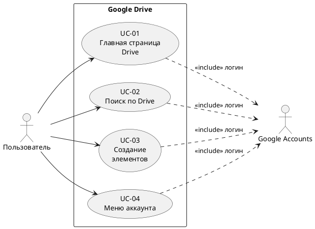

# Прецеденты использования (Use Cases) — Google Drive

Сайт: <https://drive.google.com/>
Актёр: **Пользователь Drive** (залогинен в Google-аккаунте).

## Список прецедентов

| ID    | Прецедент                              | Описание                                                                          |
|-------|----------------------------------------|-----------------------------------------------------------------------------------|
| UC-01 | Открыть главную страницу Drive         | Пользователь видит «Главное / Личный», есть кнопка «Создать», title с «Google Диск».|
| UC-02 | Поиск по Drive                         | Пользователь видит поле поиска `Поиск на Диске`, может ввести в него запрос.       |
| UC-03 | Создание элемента                      | Пользователь нажимает кнопку «Создать» — открывается меню с пунктами (в т.ч. про папку).|
| UC-04 | Просмотр меню аккаунта                 | В правом верхнем углу видна кнопка аватара аккаунта Google.                       |

## UseCase-диаграмма (PlantUML)

## Текстовое описание сценариев

### UC-01. Главная страница Drive

| Шаг | Действие                                                | Ожидание                                              |
|-----|---------------------------------------------------------|-------------------------------------------------------|
| 1   | Открыть `drive.google.com`                              | URL содержит `drive.google.com/drive`                |
| 2   | Прочитать `<title>`                                      | Содержит «Google Диск»                                |
| 3   | Найти кнопку «Создать»                                   | Кнопка видима                                         |

### UC-02. Поиск по Drive

| Шаг | Действие                                            | Ожидание                                                       |
|-----|-----------------------------------------------------|----------------------------------------------------------------|
| 1   | Найти `<input name="q">` (поле поиска)              | Поле видимо и активно                                          |
| 2   | Кликнуть в поле и ввести «отчёт»                    | `value` поля совпадает с введённой строкой                     |

### UC-03. Создание элемента

| Шаг | Действие                                            | Ожидание                                                       |
|-----|-----------------------------------------------------|----------------------------------------------------------------|
| 1   | Кликнуть кнопку «Создать»                           | Меню разворачивается                                           |
| 2   | Найти пункт меню с подстрокой «апк» (про папку)     | Пункт виден                                                    |

### UC-04. Меню аккаунта

| Шаг | Действие                                                  | Ожидание                                              |
|-----|-----------------------------------------------------------|-------------------------------------------------------|
| 1   | Найти элемент с `aria-label`, начинающимся с «Аккаунт Google» | Виден аватар (значит, мы залогинены)              |
